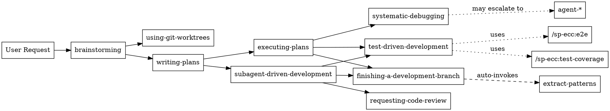

# Superpower-ECC Architecture

## Overview

Superpower-ECC is an integration project combining:
- **[Superpowers v4.1.1](https://github.com/obra/superpowers)** by Jesse Vincent - Systematic workflow discipline
- **[Everything Claude Code v1.4.1](https://github.com/affaan-m/everything-claude-code)** by Affaan Mustafa - Battle-tested production tools
- **Integration** by Faisal Alqarni - Combined into a two-layer architecture

Repository: https://github.com/FaisalAlqarni/sp-ecc

The architecture is designed around two distinct layers that work together while maintaining clear boundaries.

**Design Principles:**
- **Workflow First**: Systematic workflows guide the overall process
- **Tool Flexibility**: Quick tools available as shortcuts when appropriate
- **Specialist Support**: Agents handle focused, specialized tasks
- **Git Safety**: Destructive git operations blocked (force push, reset --hard, rebase, clean -f)
- **User Control**: All auto-enhancements are opt-out-able

## Three-Layer Architecture

```
┌─────────────────────────────────────────────────────────────┐
│ Layer 1: Superpowers Systematic Workflows                   │
│ (Primary: Use for structured development)                   │
├─────────────────────────────────────────────────────────────┤
│ sp-ecc:brainstorming                                   │
│ sp-ecc:writing-plans                                   │
│ sp-ecc:executing-plans                                 │
│ sp-ecc:subagent-driven-development                     │
│ sp-ecc:test-driven-development (enhanced)              │
│ sp-ecc:systematic-debugging                            │
│ sp-ecc:requesting-code-review                          │
│ sp-ecc:finishing-a-development-branch                  │
│ sp-ecc:using-git-worktrees                             │
└─────────────────────────────────────────────────────────────┘

┌─────────────────────────────────────────────────────────────┐
│ Layer 2: Standalone Tools                                  │
│ (Optional: Use when workflow is overkill)                   │
├─────────────────────────────────────────────────────────────┤
│ Commands: /sp-ecc:build-fix, /sp-ecc:refactor-clean, etc. │
│ Agents: agent-name (context-loaded specialists)            │
└─────────────────────────────────────────────────────────────┘
```

### Layer 1: Systematic Workflows

**Purpose**: Comprehensive, repeatable processes for software development.

**Key Characteristics**:
- Multi-step workflows with built-in quality gates
- Enforce best practices (TDD, git worktrees, code review)
- Designed for feature development and complex changes
- Use when: You want structure, repeatability, and quality assurance

**Core Workflows**:
1. **sp-ecc:brainstorming** → **sp-ecc:writing-plans** → **sp-ecc:executing-plans**
   - Idea to implementation pipeline
   - Creates design docs and implementation plans
   - Executes task-by-task with checkpoints

2. **sp-ecc:test-driven-development**
   - Red-Green-Refactor cycle enforcement
   - Enhanced with coverage tracking and E2E generation
   - Used within executing-plans and subagent-driven-development

3. **sp-ecc:systematic-debugging**
   - Structured problem investigation
   - Hypothesis testing with experiments
   - Used when quick fixes fail

4. **sp-ecc:finishing-a-development-branch**
   - Pre-merge checklist (tests, docs, cleanup)
   - Auto-invokes pattern extraction
   - Creates PR or prepares for merge

**Enhancement Integration**:
- Layer 2 commands and agents can be used within workflows when appropriate
- Pattern extraction (extract-patterns skill) is optionally invoked by finishing-a-development-branch

### Layer 2: Standalone Tools

**Purpose**: Quick, focused tools for specific tasks when workflow overhead is unnecessary.

**Key Characteristics**:
- Standalone operations, not part of larger workflow
- Context-loaded specialists with deep expertise
- Fast path for experienced developers
- Use when: You know exactly what you need and workflow is overkill

**Commands** (`/sp-ecc:*`):
- **Quick Fixes**: `/sp-ecc:build-fix`, `/sp-ecc:refactor-clean`
- **Testing**: `/sp-ecc:test-coverage`, `/sp-ecc:e2e`
- **Code Quality**: `/sp-ecc:update-docs`, `/sp-ecc:verify`
- **Development**: `/sp-ecc:go-test`, `/sp-ecc:python-review`
- **Workflows**: `/sp-ecc:multi-plan`, `/sp-ecc:multi-execute`

**Agents** (`agent-*`):
- **Specialists**: `build-error-resolver`, `test-failure-analyzer`
- **Domain Experts**: `security-auditor`, `performance-optimizer`
- **Language-Specific**: `python-refactorer`, `typescript-enhancer`

**Git Safety**:
- Destructive git operations are blocked (force push, reset --hard, rebase, clean -f)
- Normal operations allowed: `git commit`, `git push`, `git add`, `git checkout`, `git merge`, `git pull`
- Read operations always allowed: `git status`, `git diff`, `git log`
- See Git Policy section below

## Component Relationships

### How Skills Interact



### How Agents Work

**Agent Lifecycle**:
1. User or skill invokes agent (e.g., `@build-error-resolver`)
2. Agent loads with specialized context and constraints
3. Agent analyzes situation with domain expertise
4. Agent provides recommendations or performs focused task
5. Agent respects git restrictions (read-only)
6. Agent reports completion without git operations

**Agent Escalation** (build-error-resolver example):
```
User hits build error
  └─> Invokes build-error-resolver agent
      ├─> Quick pattern-match attempt (80% of cases)
      │   └─> Success: Report fix
      │   └─> Failure: Escalate to systematic-debugging
      └─> systematic-debugging workflow
          └─> Deep investigation with experiments
```

**When to Use Agents**:
- Specific, focused task with clear scope
- Need deep domain expertise
- Want fast resolution without workflow overhead
- Task fits within single conversation turn

### How Commands Work

**Command Invocation**:
```
User: /sp-ecc:build-fix
  └─> Command loads with specific instructions
      └─> Analyzes build errors
      └─> Suggests or applies fixes
      └─> Reports completion (no git commit)
```

**Command vs Skill Decision Tree**:
```
Need to commit changes?
  ├─> Yes: Use Layer 1 workflow (executing-plans)
  └─> No: Can use /sp-ecc:command

Need multi-step process?
  ├─> Yes: Use Layer 1 workflow
  └─> No: Can use /sp-ecc:command

Need quality gates?
  ├─> Yes: Use Layer 1 workflow
  └─> No: Can use /sp-ecc:command

Just need quick analysis/suggestion?
  └─> Yes: Use /sp-ecc:command
```

## Brainstorm-to-Merge Pipeline

The brainstorm-to-merge pipeline provides a fully automated path from initial idea through to a merge-ready PR. It is invoked via `/sp-ecc:brainstorm` and orchestrates design, workspace setup, implementation, multi-stage review, and finalization.

> **Design doc**: `docs/plans/2026-03-14-pipeline-redesign.md`

### Pipeline Flow

```
/sp-ecc:brainstorm
  └─> Interactive design session (iterative brainstorming)
      └─> Design completion decision (4 options)
          └─> Workspace setup (worktree or branch)
              └─> Per-task implementation loop
                  └─> After-all-tasks stages
                      └─> Merge / PR
```

### Design Completion Options

After the brainstorming phase produces a design, the user is presented with four options:

1. **Ready** -- Accept the design and proceed to implementation.
2. **Revise** -- Continue iterating on the design before proceeding.
3. **Save & exit** -- Persist the current design for later resumption.
4. **Discard & start fresh** -- Throw away the design and restart brainstorming.

### Workspace Setup

Once the design is accepted, the pipeline sets up an isolated workspace. Two strategies are supported:

- **Worktree** (recommended) -- Creates a git worktree for full isolation from the main working tree. Uses `sp-ecc:using-git-worktrees`.
- **Direct branch** -- Creates and checks out a new branch in the current working tree. Simpler but shares the working directory.

### Multi-Stage Per-Task Review

Each task in the implementation plan passes through a series of review stages before the next task begins. The token budget is approximately **12-14K tokens per task**.

```
Task N implementation
  └─> spec review        (does the code match the task specification?)
  └─> quality review     (code quality, patterns, maintainability)
  └─> security review    (always runs -- vulnerability and exposure check)
  └─> verification gate  (conditional -- runs for tasks involving logging or database changes)
```

- **spec**: Validates the implementation against the task specification.
- **quality**: Checks code style, patterns, duplication, and maintainability.
- **security**: Always executes. Scans for vulnerabilities, credential exposure, injection risks.
- **verification gate**: Conditionally executes when the task touches logging or database layers. Validates log levels, query safety, migration correctness, etc.

### After-All-Tasks Stages

Once every task has been implemented and reviewed, a set of one-time finalization stages runs. The token budget for these stages is approximately **16K tokens (one-time)**.

```
All tasks complete
  └─> e2e-runner          (end-to-end test execution)
  └─> doc-updater         (update documentation to reflect changes)
  └─> verification-loop   (iterative fix cycle until all checks pass)
  └─> final code review   (comprehensive review of the full changeset)
  └─> refactor-cleaner    (remove dead code, simplify, polish)
  └─> Merge / PR creation
```

- **e2e-runner**: Executes end-to-end tests across the full changeset.
- **doc-updater**: Ensures documentation (READMEs, inline docs, API docs) reflects the changes.
- **verification-loop**: Iterates on any remaining failures until all tests and checks pass.
- **final code review**: A comprehensive review of the entire branch diff, not just individual tasks.
- **refactor-cleaner**: Final cleanup pass -- removes dead code, simplifies overly complex sections, and polishes naming.

### Token Budget Summary

| Phase | Budget |
|-------|--------|
| Per task (spec + quality + security + conditional verification) | ~12-14K tokens |
| After all tasks (e2e + docs + verification + review + refactor) | ~16K tokens (one-time) |

## Git Safety Enforcement

**Policy**: Normal git operations are allowed. Only destructive operations that can rewrite history or cause irreversible data loss are blocked.

### Allowed Operations

**Normal Git Commands** (all allowed):
```bash
git add <files>         # Stage changes
git commit -m "msg"     # Create commits
git push                # Push to remote
git pull                # Pull from remote
git checkout <branch>   # Switch branches
git branch <name>       # Create branches
git merge <branch>      # Merge branches
git fetch               # Fetch from remote
git stash               # Stash changes
git worktree add        # Create worktrees
git status              # Check current state
git diff                # See changes
git log                 # View commit history
```

### Blocked Operations (Destructive Only)

**Hook System** (Primary defense):
- `scripts/hooks/block-destructive-git.js` (PreToolUse hook)
- Blocks only operations that can cause irreversible damage
- Provides clear error message to Claude

**Blocked Operations**:
```javascript
const BLOCKED_OPERATIONS = [
  /git push.*--force/,      // Force push (rewrites remote history)
  /git push.*-f/,           // Force push shorthand
  /git reset --hard/,       // Hard reset (discards uncommitted changes)
  /git clean -f/,           // Force clean (permanently deletes untracked files)
  /git branch -D/,          // Force delete branch (may lose unmerged work)
  /git checkout -- \./,     // Checkout all files (discards all working changes)
  /git rebase/,             // Rebase (rewrites commit history)
];
```

### Co-Author Stripping

A separate `strip-coauthor.js` hook automatically removes `Co-Authored-By` trailer lines from commit messages, keeping the git history clean.

### Agent Guidelines

All 13 agents include guidance on git usage:
- Normal git operations are encouraged where appropriate
- Destructive operations should be avoided
- Agents can commit, push, and create branches as needed

## Hooks Execution Flow

**Hook Types** (from `hooks/hooks.json`):

1. **PreToolUse**: Before any tool execution
2. **PostToolUse**: After any tool execution
3. **SessionStart**: At session beginning
4. **SessionEnd**: At session end
5. **PreCompact**: Before context compression
6. **Stop**: On conversation stop

### Hook Execution Order

**Session Lifecycle**:
```
Session Start
  └─> SessionStart hooks execute
      ├─> Hook 1: Session initialization
      └─> Hook 2: Load user preferences

User Message
  └─> Claude decides to use tool
      └─> PreToolUse hooks execute
          ├─> Hook 1: Git write blocker
          ├─> Hook 2: TypeScript type checking
          └─> Hook 3: Console.log warning
      └─> Tool executes (if not blocked)
      └─> PostToolUse hooks execute
          └─> Hook 1: Result validation

Context Full
  └─> PreCompact hooks execute
      ├─> Hook 1: Save important context
      └─> Hook 2: Mark checkpoint
  └─> Context compression occurs

Session End
  └─> SessionEnd hooks execute
      ├─> Hook 1: Session evaluation
      ├─> Hook 2: Save learnings
      └─> Hook 3: Cleanup temp files

User Stop
  └─> Stop hooks execute
      └─> Hook 1: Graceful shutdown
```

### Destructive Git Blocker (Detailed)

**File**: `scripts/hooks/block-destructive-git.js`

**Execution**:
1. Claude attempts Bash tool call with a destructive git command
2. PreToolUse hook intercepts (matcher filters for destructive patterns)
3. Hook checks command against regex patterns
4. If destructive: Return error to Claude, block execution
5. If normal: Allow tool execution

**Error Message to Claude**:
```
[Hook] BLOCKED: Destructive git operation detected
[Hook] Reason: Force push (rewrites remote history)
[Hook] Policy: Destructive git operations are blocked for safety.
[Hook] Normal git operations (commit, push, add, branch, merge) are allowed.
```

**Claude's Response**:
- Receives error before tool execution
- Uses a non-destructive alternative
- Continues with normal git operations

### Optional Hooks (Opt-Out Available)

See `docs/integration/OPT-OUT.md` for disabling:
- SessionEnd evaluation hook
- Console.log warning hook
- TypeScript type checking hook

## Naming Conventions

**Strict Naming Rules**:

### Layer 1: Superpowers Workflows
```
Format: sp-ecc:<workflow-name>
Examples:
  - sp-ecc:brainstorming
  - sp-ecc:test-driven-development
  - sp-ecc:executing-plans

Invocation: Automatic by Claude based on task
File Location: skills/<workflow-name>/SKILL.md
```

### Layer 2: Commands
```
Format: /sp-ecc:<command-name>
Examples:
  - /sp-ecc:build-fix
  - /sp-ecc:test-coverage
  - /sp-ecc:refactor-clean

Invocation: User types /sp-ecc:command-name
File Location: commands/ecc-<command-name>.md
Internal Reference: ecc-<command-name>
```

### Layer 2: Agents
```
Format: agent-<specialty>
Examples:
  - agent-build-error-resolver
  - agent-test-failure-analyzer
  - agent-security-auditor

Invocation: User types @agent-name or skill escalates
File Location: agents/<specialty>.md
Display Name: <specialty> (no agent- prefix in docs)
```

### Language Skills
```
Format: <language>-<aspect>
Examples:
  - python-patterns
  - rails-tdd
  - flutter-verification

Invocation: Auto-loaded by Claude based on file context
File Location: skills/<language>-<aspect>/SKILL.md
```

**Why These Names**:
- **sp-ecc:**: Signals workflow or skill from this plugin
- **/sp-ecc:**: Signals quick command
- **agent-**: Signals specialist entity
- Clear namespace separation prevents conflicts

## Language & Framework Skills

**Comprehensive Coverage**:
- **Python/Django**: patterns, testing, TDD, security, verification
- **Go**: patterns, testing
- **Java/Spring Boot**: patterns (JPA), TDD, security, verification
- **Ruby/Rails**: patterns (Engines focus), testing, TDD, security, verification
- **Dart/Flutter**: patterns (state management), testing, verification
- **JavaScript/TypeScript**: patterns, testing
- **Postgres/ClickHouse**: database patterns

**Auto-Loading**:
- Claude automatically loads relevant skills based on file context
- No explicit invocation needed
- Language detection from file extensions and imports
- Framework detection from project structure

**Rails Engines Emphasis**:
- 1,404 lines dedicated to Rails Engines in rails-patterns/SKILL.md
- Covers: Mountable vs Full engines, isolation, testing, migrations
- Critical for projects using Rails Engines architecture

**Flutter State Management**:
- Decision matrices for Bloc/Cubit vs Riverpod vs Provider
- When to use each pattern
- Performance and testing considerations

## Component Directory Structure

```
superpowers/
├── agents/                    # Layer 2: Specialist agents
│   ├── build-error-resolver.md
│   ├── test-failure-analyzer.md
│   └── ... (13 total)
│
├── commands/                  # Layer 2: Quick commands
│   ├── ecc-build-fix.md
│   ├── ecc-test-coverage.md
│   └── ... (26 total)
│
├── skills/                    # Layer 1 + Language skills
│   ├── brainstorming/
│   ├── test-driven-development/
│   ├── python-patterns/
│   ├── rails-patterns/       # 2,319 lines (1,404 on Engines)
│   ├── flutter-patterns/
│   └── ... (40+ skills)
│
├── skills/extract-patterns/    # Pattern extraction (optional, invoked by finishing skill)
│
├── scripts/hooks/             # Hook implementations
│   ├── block-destructive-git.js # Destructive git blocker
│   ├── session-start.js
│   └── session-end.js
│
├── hooks/
│   └── hooks.json             # Hook configuration
│
├── mcp-configs/               # MCP server configurations
│   ├── clickhouse-server.json
│   └── postgres-server.json
│
├── rules/                     # Global rules
│   ├── YAGNI-ruthlessly.md
│   └── ... (8 rules)
│
└── docs/integration/          # Integration documentation
    ├── USAGE.md               # How to use three layers
    ├── OPT-OUT.md             # How to disable features
    └── ARCHITECTURE.md        # This document
```

## Key Architectural Decisions

### 1. Why Three Layers?

**Problem**: Two competing approaches to AI-assisted development
- Superpowers: Comprehensive workflows, lots of structure
- ECC: Quick tools, minimal ceremony

**Solution**: Layer system that preserves both
- Layer 1: When you want structure (new features, learning)
- Layer 2: When you're experienced and know exactly what you need

**Trade-off**: More complexity, but much more flexibility

### 2. Why Block Destructive Git Only?

**Problem**: Blocking all git writes (commit, push, merge) creates too much friction
- Users must manually run every git command
- Workflows can't automate common operations
- Worktree management becomes impossible

**Solution**: Block only truly destructive operations
- Force push, hard reset, rebase, clean -f are blocked
- Normal operations (commit, push, merge, branch) are allowed
- AI can work through full git workflows

**Trade-off**: Slightly less restrictive, but much more practical while still safe

### 3. Why Opt-Out Instead of Opt-In?

**Problem**: Useful features often go undiscovered
- Users don't know about E2E generation
- Pattern extraction never gets used
- Automation benefits lost

**Solution**: Auto-invoke useful features, document opt-out
- E2E suggestions appear automatically in TDD
- Pattern extraction runs after feature completion
- Clear documentation on disabling anything

**Trade-off**: Some users may find it too proactive, but docs make opt-out trivial

### 4. Why Hooks for Destructive Git Blocking?

**Problem**: AI instructions alone are unreliable for preventing destructive operations
- AI might forget or misinterpret safety boundaries
- Different context windows, different behavior
- Destructive operations need hard guarantees

**Solution**: PreToolUse hook enforcement for destructive operations
- Blocks destructive commands at tool execution level
- Cannot be bypassed by AI
- Clear error messages guide AI to non-destructive alternatives

**Trade-off**: Requires hooks system, but necessary for safety

## Performance Considerations

**Token Usage**:
- Layer 1 workflows: Higher token usage (comprehensive)
- Layer 2 tools: Lower token usage (focused)

**Initial Cost (~25% higher with this integration)**:
- More context loaded (skills, modes, agents)
- More features auto-invoked
- But: Higher quality output, fewer iterations

**Long-Term Benefit**:
- Pattern extraction reduces repeated explanations
- Better code quality = fewer debugging sessions
- Comprehensive language skills = faster development
- Worth the cost for production work

**Optimization Tips**:
- Use Layer 2 for quick tasks (lower token usage)
- Opt-out of features you don't need
- Pattern extraction pays off over time
- Use language skills consistently (AI learns patterns)

## Extension Points

**Adding New Language Support**:
1. Create `skills/<language>-patterns/SKILL.md`
2. Create `skills/<language>-testing/SKILL.md`
3. Optionally: `<language>-tdd`, `<language>-security`
4. Follow existing skill structure (rails-patterns as template)

**Adding New Agents**:
1. Create `agents/<specialty>.md`
2. Add Git Policy section (copy from existing agents)
3. Define clear scope and escalation strategy
4. Test with git write attempts (should be blocked)

**Adding New Commands**:
1. Create `commands/ecc-<name>.md`
2. Strip any git write operations
3. Use `/sp-ecc:<name>` invocation format
4. Document in USAGE.md decision trees

**Adding New Hooks**:
1. Create hook script in `scripts/hooks/`
2. Add to `hooks/hooks.json`
3. Test execution order
4. Document opt-out in OPT-OUT.md (if optional)

## Security Model

**Threat Model**:
- AI might attempt destructive git operations (force push, hard reset)
- User might forget current branch/state
- Hooks might be bypassed if not carefully implemented

**Defenses**:
1. **Destructive Git Blocker** (PreToolUse hook)
   - Primary defense against destructive operations
   - Cannot be bypassed by AI
   - Regex-based matching for accuracy

2. **Co-Author Stripping** (PreToolUse hook)
   - Strips Co-Authored-By lines from commit messages
   - Keeps git history clean

3. **Agent Guidelines** (Git Policy sections)
   - Guide AI toward safe git usage
   - Discourage destructive operations

4. **User Awareness** (Documentation)
   - USAGE.md explains git safety model
   - OPT-OUT.md shows control points
   - ARCHITECTURE.md (this doc) explains enforcement

**Limitations**:
- Cannot prevent user from disabling hooks
- Normal git operations are allowed by design

**Best Practices**:
- Work in git worktrees for feature isolation (sp-ecc:using-git-worktrees)
- Review AI-generated commits before pushing
- Keep hooks.json configuration under version control

## Troubleshooting

**"Destructive git operation blocked" Error**:
- Expected: Hook is blocking a destructive operation
- Action: Use a non-destructive alternative (e.g., `git push` instead of `git push --force`)
- Check: Are you in a worktree? (recommended)

**Mode Skill Not Activating**:
- Check: Is Layer 1 workflow invoking it?
- Mode skills are not user-invocable
- Use Layer 1 workflow that includes mode

**Agent Not Found**:
- Check: Is filename `agents/<specialty>.md`?
- Invocation: `@agent-<specialty>` or just `<specialty>`
- List all: `ls agents/`

**Command Not Found**:
- Check: Is filename `commands/ecc-<name>.md`?
- Invocation: `/sp-ecc:<name>`
- List all: `ls commands/ecc-*.md`

**Language Skill Not Loading**:
- Auto-loading based on file context
- Check: Are you working in relevant files?
- Explicitly mention language if needed

**Hooks Not Executing**:
- Check: `hooks/hooks.json` exists and valid JSON
- Verify: Hook script exists in `scripts/hooks/`
- Test: Attempt destructive git operation like `git push --force` (should be blocked)

**E2E Tests Too Aggressive**:
- See: `docs/integration/OPT-OUT.md`
- Disable: Comment lines 225-244 in test-driven-development/SKILL.md
- Opt-out available for all auto-features

## Version History

**v1.0.0** (2026-02-06) - Initial release:

**Based on:**
- Superpowers v4.1.1 by Jesse Vincent
- Everything Claude Code v1.4.1 by Affaan Mustafa

**Integrated from Superpowers v4.1.1:**
- Systematic workflows (brainstorming, planning, execution, TDD, debugging, code review)
- Git worktrees workflow
- Subagent-driven development
- Core language skills (Python/Django, Go, Java/Spring Boot)

**Integrated from Everything Claude Code v1.4.1:**
- 13 specialist agents (Layer 2)
- 26 quick commands (Layer 2)
- Hooks system (6 hook types)
- Git write blocker (security)
- Pattern extraction system

**Integration additions:**
- Two-layer architecture combining both projects
- Enhanced TDD with coverage tracking and E2E generation
- Multi-language support (Ruby/Rails, Dart/Flutter, Python/Django, Go, Java/Spring Boot)
- Comprehensive documentation (USAGE, OPT-OUT, ARCHITECTURE, MIGRATION)
- Pipeline enforcement with efficiency tiers and recovery paths

**Source Projects:**
- Superpowers v4.1.1 by Jesse Vincent: https://github.com/obra/superpowers
- Everything Claude Code v1.4.1 by Affaan Mustafa: https://github.com/affaan-m/everything-claude-code

**This Project:**
- Repository: https://github.com/FaisalAlqarni/sp-ecc
- Created and maintained by: Faisal Alqarni

## Future Considerations

**Potential Enhancements**:
- Additional language support (Rust, Swift, Kotlin)
- More specialized agents (accessibility-auditor, i18n-validator)
- Performance profiling commands (/sp-ecc:profile, /sp-ecc:benchmark)
- Integration testing workflows (sp-ecc:integration-testing)
- Database migration patterns (rails-migrations, django-migrations)

**Known Limitations**:
- Destructive git operations blocked (by design)
- Cannot work across multiple worktrees simultaneously
- Pattern extraction requires manual periodic instinct-export
- Hooks require Node.js runtime

**Research Questions**:
- Can pattern extraction reduce token usage over time?
- What's the optimal balance between auto-features and opt-out?
- Are there cases where git writes should be allowed?

---

**Related Docs**: USAGE.md, OPT-OUT.md, MIGRATION.md
