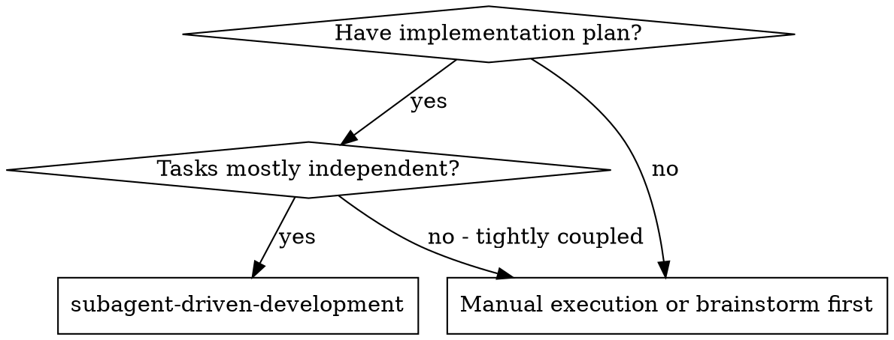
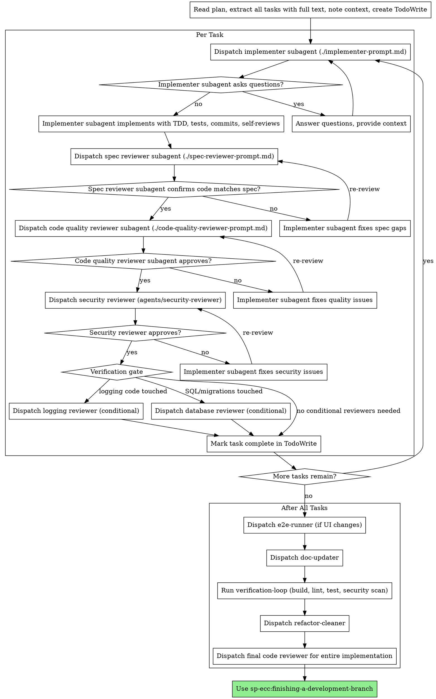

# Subagent-Driven Development

Execute plan by dispatching fresh subagent per task, with multi-stage review after each: spec compliance, code quality, security, and conditional verification gate.

**Core principle:** Fresh subagent per task + multi-stage review = high quality, fast iteration

## When to Use



## Pipeline State File

The pipeline state file is the backbone of enforcement and context resilience.

**Location**: `docs/plans/YYYY-MM-DD-<feature-name>-pipeline-state.md`

Matches naming of design doc (`-design.md`) and plan doc (`-plan.md`). Each pipeline gets its own state file.

**Lifecycle**:
1. Created when subagent-driven-development starts
2. Updated after each stage completes (checklist items checked)
3. Read by any stage that needs to know "where are we"
4. Read on session resume to pick up where we left off
5. Deleted by finishing-a-development-branch after merge/PR/discard

**Gate enforcement**: Before dispatching any reviewer, read the checklist. If the previous required stage isn't checked, do not proceed. Before `sp-ecc:finishing-a-development-branch` presents options, it reads the file and refuses if any required items are unchecked.

**Example file**:
```markdown
# Pipeline State: auth-system
Created: 2026-03-14
Phase: executing (task 3 of 5)

## Config
Workspace: worktree at .worktrees/auth-system
Design: docs/plans/2026-03-14-auth-system-design.md
Plan: docs/plans/2026-03-14-auth-system-plan.md

## Tasks
### Task 1: Create schema [COMPLETE] [tier: light]
- [x] Implementer: done
- [x] Spec review: PASS

### Task 2: Auth middleware [COMPLETE] [tier: thorough]
- [x] Implementer: done
- [x] Spec review: PASS
- [x] Quality review: PASS
- [x] Security review: PASS — no issues

### Task 3: API routes [IN PROGRESS] [tier: standard]
- [x] Implementer: done
- [ ] Spec review: PENDING
- [ ] Quality review: PENDING

### Task 4: Client components [PENDING] [tier: standard]
### Task 5: Tests [PENDING] [tier: light]

## After All Tasks [highest tier: thorough]
- [ ] E2E runner
- [ ] Doc-updater
- [ ] Verification-loop
- [ ] Refactor-cleaner
- [ ] Final code review
```

## Efficiency Tiers

After each implementer completes, analyze the actual diff to determine tier. NOT from plan text — from real code changes.

**Detection heuristics**:
```
THOROUGH if ANY of:
  - Diff touches: auth, session, token, password, secret, crypto,
    payment, billing, charge (filenames or content)
  - Diff touches migration files or schema definitions
  - Diff adds/modifies SQL queries or ORM query builders
  - Diff touches user input handling (forms, request params, API body)
  - Diff adds new public API endpoints
  - Lines changed > 300

LIGHT if ALL of:
  - Lines changed < 50
  - Files touched <= 2
  - None of THOROUGH triggers matched
  - No new test files created

STANDARD: everything else
```

**Per-task review stages by tier**:

| Stage | Light | Standard | Thorough |
|-------|-------|----------|----------|
| Spec review | Yes | Yes | Yes |
| Quality review | Skip | Yes | Yes |
| Security review | Skip | Skip | Yes |
| Logging review | Skip | Skip | If logging touched |
| Database review | Skip | Skip | If SQL touched |

**After-all-tasks by HIGHEST tier across all tasks**:

| Stage | Light | Standard | Thorough |
|-------|-------|----------|----------|
| E2E runner | Skip | If UI changes | Yes |
| Doc-updater | Skip | If public API | Yes |
| Verification-loop | Yes | Yes | Yes |
| Refactor-cleaner | Skip | Yes | Yes |
| Final code review | Skip | Yes | Yes |

## The Process



*Note: The diagram above shows the full (Thorough) path. Stages are skipped per the tier tables below.*

## Per-Task Review Stages

### Stage 1: Spec Compliance (ALWAYS)
- Dispatch spec reviewer subagent using `./spec-reviewer-prompt.md`
- Verifies: everything requested was built, nothing extra
- If fail: implementer fixes → re-review until pass

### Stage 2: Code Quality (Standard + Thorough tiers)
- Dispatch code quality reviewer using `./code-quality-reviewer-prompt.md`
- Verifies: clean, tested, maintainable code
- If fail: implementer fixes → re-review (max 3 cycles, then escalate to user)
- **Skip for Light tier**

### Stage 3: Security (Thorough tier only)
- Dispatch security-reviewer agent
- Verifies: OWASP Top 10, injection, secrets, auth patterns
- May return "N/A — no security-relevant code" for simple tasks
- If fail: implementer fixes → re-review (max 3 cycles, then escalate to user)
- **Skip for Light and Standard tiers**

### Stage 4: Verification Gate (Thorough tier, CONDITIONAL)
- **Logging reviewer** — dispatched if task touches logging code (console.log, logger calls, log configuration)
- **Database reviewer** — dispatched if task touches SQL, migrations, schema, or ORM queries
- If either reviewer finds issues: implementer fixes → re-review (max 3 cycles, then escalate to user)
- **Skip for Light and Standard tiers**

**A task is NOT complete until all applicable stages pass.**

## After All Tasks Complete

Before running after-all-tasks stages, compute the **highest tier** across all completed tasks and record it in the pipeline-state.md `## After All Tasks [highest tier: X]` header. This determines which after-all-tasks stages run.

Run these stages in order before finishing:

### 1. E2E Runner (conditional)
- Dispatch e2e-runner agent if implementation includes UI or feature changes affecting user flows
- Skip if backend-only or infrastructure changes

### 2. Doc-Updater (Standard + Thorough tiers)
- Dispatch doc-updater agent to update codemaps, READMEs, and architecture docs
- Must run before final review so reviewer sees complete documentation
- Standard tier: only if public API changes; Thorough tier: always
- **Skip for Light tier**

### 3. Verification Loop (always)
- **REQUIRED SKILL:** Use sp-ecc:verification-loop
- Full quality gate: build → type check → lint → test suite → security scan → diff review
- If any gate fails: follows retry protocol (fix → re-run → max 3 attempts → escalate)

### 4. Refactor-Cleaner (Standard + Thorough tiers)
- Dispatch refactor-cleaner agent for dead code removal
- Catches unused imports, abandoned approaches, temporary code from iteration
- Runs BEFORE final review so reviewer sees clean code
- **Skip for Light tier**

### 5. Final Code Review (Standard + Thorough tiers)
- Dispatch code-reviewer agent for the entire implementation (all commits since plan started)
- Reviews cross-task integration, overall architecture, and completeness
- **Runs LAST — no code modifications after this point**
- **Skip for Light tier**

### 6. Finish
- **REQUIRED SKILL:** Use sp-ecc:finishing-a-development-branch
- Verify tests → summarize work → present merge/PR/keep/discard options

## Recovery Paths

**If verification-loop fails:**
1. Dispatch fix subagent with failure details
2. Fix subagent addresses specific failures
3. Re-run verification-loop
4. If fail again: repeat (max 3 attempts)
5. After 3 failures: STOP, report to user with failure list
6. Write failure to pipeline-state.md

**If reviewer rejects (any stage):**
1. Implementer fixes issues
2. Reviewer re-reviews
3. Max 3 cycles per reviewer per task
4. After 3 rejections: escalate to user
5. Write rejection history to pipeline-state.md

## Context Resilience

The pipeline state file is the primary mechanism for surviving context loss.

**Before dispatching any subagent:**
1. Read `docs/plans/*-pipeline-state.md` to know current state
2. After subagent completes, UPDATE pipeline-state.md immediately
3. If context feels compressed, re-read pipeline-state.md to refresh

**What survives on disk (not in conversation):**
- Design doc → `docs/plans/YYYY-MM-DD-<feature>-design.md`
- Plan → `docs/plans/YYYY-MM-DD-<feature>-plan.md`
- Pipeline state → `docs/plans/YYYY-MM-DD-<feature>-pipeline-state.md`
- Subagent prompts reference disk files, not conversation context

**Advisory:** Consider `/compact` between tasks as a natural boundary. Pipeline state file ensures nothing is lost.

## Prompt Templates

- `./implementer-prompt.md` - Dispatch implementer subagent (TDD enforced)
- `./spec-reviewer-prompt.md` - Dispatch spec compliance reviewer subagent
- `./code-quality-reviewer-prompt.md` - Dispatch code quality reviewer subagent

## Example Workflow

```
You: I'm using Subagent-Driven Development to execute this plan.

[Read plan file once: docs/plans/feature-plan.md]
[Extract all 5 tasks with full text and context]
[Create TodoWrite with all tasks]

Task 1: Hook installation script

[Get Task 1 text and context (already extracted)]
[Dispatch implementation subagent with full task text + context]

Implementer: "Before I begin - should the hook be installed at user or system level?"

You: "User level (~/.config/sp-ecc/hooks/)"

Implementer: "Got it. Writing failing test first..."
[Later] Implementer:
  - Wrote failing test for install-hook
  - Implemented install-hook command (test green)
  - Added edge case tests, 5/5 passing
  - Self-review: Found I missed --force flag, added it
  - Committed

[Dispatch spec compliance reviewer]
Spec reviewer: ✅ Spec compliant - all requirements met, nothing extra

[Dispatch code quality reviewer]
Code reviewer: Strengths: Good test coverage, clean. Issues: None. Approved.

[Dispatch security reviewer]
Security reviewer: ✅ N/A - no security-relevant code in this task

[Verification gate: no logging or DB code touched — skip conditional reviewers]

[Mark Task 1 complete]

Task 2: Auth middleware

[Dispatch implementation subagent]
Implementer: Implemented auth middleware with TDD, 8/8 tests passing

[Spec reviewer] ✅ Spec compliant
[Code quality reviewer] ✅ Approved
[Security reviewer] ❌ Issues:
  - Session token stored in plain text cookie
  - Missing CSRF protection

[Implementer fixes security issues]
[Security reviewer re-reviews] ✅ Approved

[Verification gate: no logging or DB code — skip]
[Mark Task 2 complete]

...

[After all tasks]
[E2E runner: UI changes detected, running e2e tests — ✅ pass]
[Doc-updater: Updated README and codemaps]
[Verification-loop: build ✅, lint ✅, tests ✅, security scan ✅]
[Refactor-cleaner: Removed 3 unused imports, 1 dead helper function]
[Final code reviewer: All requirements met, clean integration — LAST stage, no changes after this]

[sp-ecc:finishing-a-development-branch]
Done!
```

## Advantages

**vs. Manual execution:**
- Subagents follow TDD (enforced in prompt, not optional)
- Fresh context per task (no confusion)
- Parallel-safe (subagents don't interfere)
- Subagent can ask questions (before AND during work)

**Quality gates:**
- Self-review catches issues before handoff
- Multi-stage review: spec → quality → security → conditional gate
- Review loops ensure fixes actually work
- Spec compliance prevents over/under-building
- Security review catches vulnerabilities per task, not just at the end
- Verification gate catches domain-specific issues (logging, database)

**After-all-tasks stages:**
- E2E catches broken user flows across tasks
- Doc-updater keeps documentation in sync
- Verification-loop provides full CI-level quality gate
- Refactor-cleaner removes iteration debris
- Final review catches cross-task integration issues (runs LAST)

**Efficiency:**
- Light tier skips unnecessary reviews for trivial changes
- Standard tier balances quality and speed
- Thorough tier provides full coverage for critical code
- Tier auto-detection means no manual configuration needed

## Red Flags

**Never:**
- Start implementation on main/master branch without explicit user consent
- Skip any review stage (spec, quality, security)
- Proceed with unfixed issues from any reviewer
- Dispatch multiple implementation subagents in parallel (conflicts)
- Make subagent read plan file (provide full text instead)
- Skip scene-setting context (subagent needs to understand where task fits)
- Ignore subagent questions (answer before letting them proceed)
- Accept "close enough" on spec compliance (spec reviewer found issues = not done)
- Skip review loops (reviewer found issues = implementer fixes = review again)
- Let implementer self-review replace actual review (both are needed)
- **Start code quality review before spec compliance is ✅** (wrong order)
- **Start security review before code quality is ✅** (wrong order)
- Move to next task while any review has open issues
- Skip after-all-tasks stages
- Run final code review before refactor-cleaner (wrong order — refactor first, then final review)
- Skip pipeline-state.md updates after stage completion
- Proceed to next stage when previous required stage is unchecked in pipeline-state.md
- Retry more than 3 times without escalating to user

**If subagent asks questions:**
- Answer clearly and completely
- Provide additional context if needed
- Don't rush them into implementation

**If reviewer finds issues:**
- Implementer (same subagent) fixes them
- Reviewer reviews again
- Max 3 cycles per reviewer per task
- After 3 rejections: escalate to user, write to pipeline-state.md
- Don't skip the re-review

**If subagent fails task:**
- Dispatch fix subagent with specific instructions
- Don't try to fix manually (context pollution)

## Integration

**Required workflow skills:**
- **sp-ecc:writing-plans** - Creates the plan this skill executes
- **sp-ecc:verification-loop** - Full quality gate after all tasks
- **sp-ecc:verification-before-completion** - Evidence before completion claims
- **sp-ecc:finishing-a-development-branch** - Complete development after all stages

**Required agents (per task):**
- **security-reviewer** - Thorough tier only
- **logging-reviewer** - Thorough tier, conditional: if logging code touched
- **database-reviewer** - Thorough tier, conditional: if SQL/migrations touched

**Required agents (after all tasks):**
- **e2e-runner** - Conditional: if UI/feature changes (Standard + Thorough)
- **doc-updater** - Standard (if public API) + Thorough
- **code-reviewer** - Standard + Thorough tiers (final review, runs LAST)
- **refactor-cleaner** - Standard + Thorough tiers

**Subagents must follow:**
- **sp-ecc:test-driven-development** - TDD is mandatory, enforced in implementer prompt

**Optional workspace:**
- **sp-ecc:using-git-worktrees** - Isolated workspace (recommended, not required)
